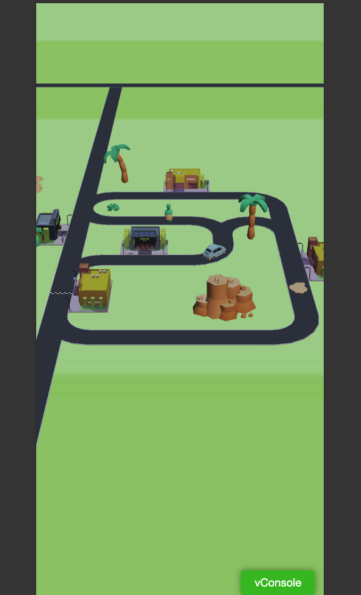
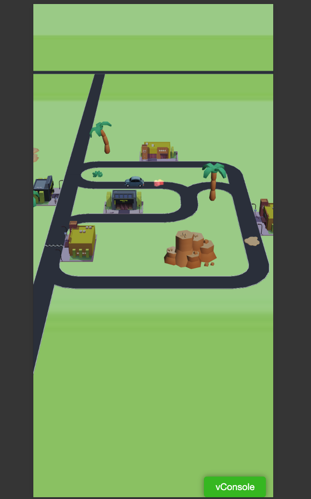

# Cocos Game Demo

## 项目简介

本项目是一个基于 Cocos Creator 2.4.4 版本的游戏项目，使用 TypeScript 编写。
游戏开始小车会以匀速行驶，当触碰到能量瓶之后，会进行加速，当触碰到减速泥潭之后，会进行减速。

## 项目结构

-   `assets`：存放游戏资源，包括图片、音频、字体等。
-   `scripts`：存放游戏脚本，包括游戏逻辑、UI 逻辑等。
-   `scenes`：存放游戏场景，包括游戏主场景、游戏菜单场景等。
-   `prefabs`：存放游戏预制体，包括游戏角色、游戏道具等。
-   `config`：存放游戏配置文件，包括游戏配置、游戏数据等。

## 小车游戏截图

